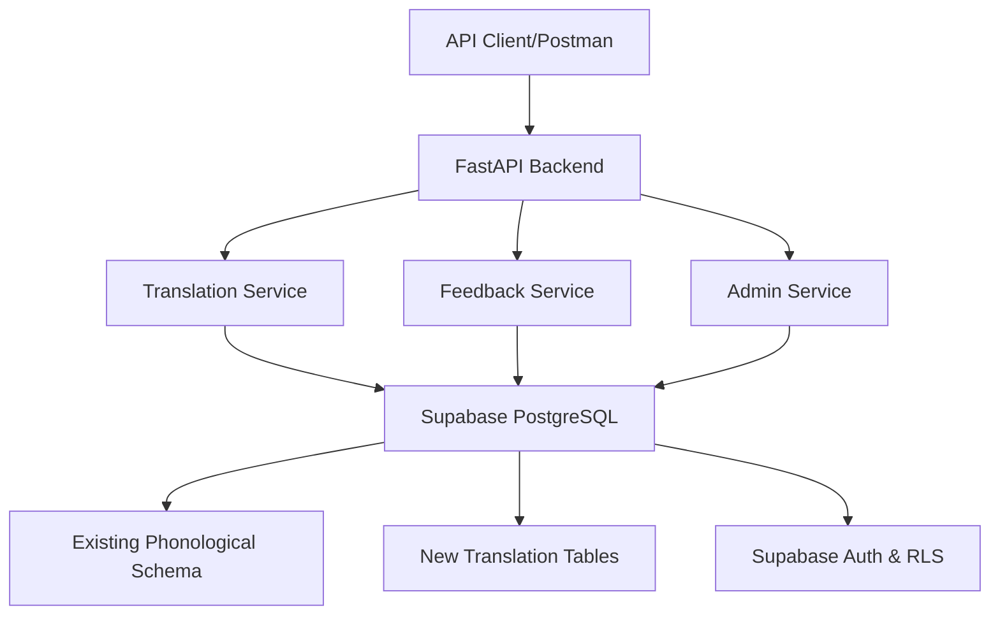

# Design Document

## Overview

The Shuar Chicham Interactive Translator is a web-based application built with Python that provides bidirectional translation between Shuar and Spanish. The system leverages a comprehensive phonological database and community-driven feedback to continuously improve translation accuracy. The architecture follows a modern web application pattern with a Python backend, PostgreSQL database, and responsive frontend.

## Architecture

### High-Level Architecture



### Technology Stack

**Backend:**
- **Framework**: FastAPI (Python 3.11+)
- **Database**: PostgreSQL with Supabase (hosted)
- **ORM**: SQLAlchemy 2.0 with Supabase integration
- **Authentication**: Supabase Auth (JWT tokens with role-based access)
- **API Documentation**: OpenAPI/Swagger (built-in with FastAPI)

**Database & Infrastructure:**
- **Database Host**: Supabase PostgreSQL
- **Row Level Security**: Supabase RLS policies
- **Real-time**: Supabase real-time subscriptions (for feedback updates)
- **Environment**: Python virtual environment

## Components and Interfaces

### 1. Translation Engine (`translation_service.py`)

**Core Responsibilities:**
- Language detection (Shuar vs Spanish)
- Exact word/phrase matching
- Phonological similarity matching
- Morphological analysis for compound words

**Key Classes:**
```python
class TranslationEngine:
    def detect_language(self, text: str) -> Language
    def translate(self, text: str, source_lang: Language, target_lang: Language) -> TranslationResult
    def find_similar_words(self, word: str, language: Language) -> List[SimilarWord]
    def analyze_morphology(self, word: str) -> MorphologicalAnalysis

class TranslationResult:
    original_text: str
    translated_text: str
    phonetic_transcription: str
    confidence_score: float
    morphological_info: Optional[MorphologicalAnalysis]
    similar_suggestions: List[SimilarWord]
```

### 2. Database Models (`models.py`)

**Leveraging Existing Schema:**
- Utilizes existing `palabras_detalladas` table
- Extends with translation-specific tables
- Maintains phonological data integrity

**New Models:**
```python
class Translation(Base):
    id: UUID
    shuar_text: str
    spanish_text: str
    confidence_score: float
    usage_count: int
    average_rating: float
    created_at: datetime
    updated_at: datetime

class TranslationFeedback(Base):
    id: UUID
    translation_id: UUID
    user_id: Optional[UUID]
    rating: int  # 1-5 stars
    comment: Optional[str]
    suggested_translation: Optional[str]
    is_approved: bool
    created_at: datetime

class User(Base):
    id: UUID
    username: str
    email: str
    role: UserRole  # visitor, community_member, expert, admin
    is_verified_shuar_speaker: bool
```

### 3. API Endpoints (`main.py`, `routers/`)

**Public Translation API:**
```python
@router.post("/translate")
async def translate_text(request: TranslationRequest) -> TranslationResponse

@router.get("/suggestions/{word}")
async def get_word_suggestions(word: str, language: str) -> List[WordSuggestion]
```

**Community Feedback API:**
```python
@router.post("/feedback")
async def submit_feedback(feedback: FeedbackRequest) -> FeedbackResponse

@router.get("/translations/{translation_id}/feedback")
async def get_translation_feedback(translation_id: UUID) -> List[Feedback]
```

**Expert Panel API:**
```python
@router.post("/admin/words")
async def add_word(word: WordCreationRequest) -> WordResponse

@router.get("/admin/pending-feedback")
async def get_pending_feedback() -> List[PendingFeedback]

@router.put("/admin/feedback/{feedback_id}/approve")
async def approve_feedback(feedback_id: UUID) -> ApprovalResponse
```

### 4. Supabase Integration (`supabase_client.py`)

**Database Connection:**
```python
from supabase import create_client, Client
import os

class SupabaseClient:
    def __init__(self):
        url = os.environ.get("SUPABASE_URL")
        key = os.environ.get("SUPABASE_ANON_KEY")
        self.client: Client = create_client(url, key)
    
    def get_client(self) -> Client:
        return self.client
    
    async def execute_query(self, query: str, params: dict = None):
        return await self.client.rpc(query, params)
```

**Authentication Integration:**
```python
class AuthService:
    def __init__(self, supabase_client: SupabaseClient):
        self.client = supabase_client.get_client()
    
    async def verify_token(self, token: str) -> Optional[User]:
        user = self.client.auth.get_user(token)
        return user
    
    async def get_user_role(self, user_id: str) -> UserRole:
        result = self.client.table('perfiles').select('rol').eq('id', user_id).execute()
        return UserRole(result.data[0]['rol']) if result.data else UserRole.VISITOR
```

## Data Models

### Translation Flow Data Structure

```python
@dataclass
class TranslationRequest:
    text: str
    source_language: Optional[str] = None
    target_language: str = "auto"
    include_phonetics: bool = True
    include_morphology: bool = True

@dataclass
class TranslationResponse:
    original_text: str
    detected_language: str
    translations: List[TranslationOption]
    phonetic_info: Optional[PhoneticInfo]
    morphological_analysis: Optional[MorphologicalInfo]
    similar_words: List[SimilarWord]
    confidence_score: float

@dataclass
class PhoneticInfo:
    ipa_transcription: str
    vocal_types: List[VocalType]  # oral, nasal, laryngealized
    syllable_count: int
    syllable_structure: str
```

### Database Integration

**Existing Schema Integration:**
- `palabras_detalladas` → Primary word repository
- `vocales`, `consonantes` → Phonological matching
- `alfabeto_shuar` → Character validation
- `caracteristicas_fonologicas` → Morphological analysis

**New Translation Tables for Supabase:**
```sql
-- Translation pairs with community validation
CREATE TABLE public.translations (
    id UUID DEFAULT uuid_generate_v4() PRIMARY KEY,
    shuar_word_id UUID REFERENCES public.palabras_detalladas(id),
    spanish_text VARCHAR(200) NOT NULL,
    context_tags VARCHAR[],
    confidence_score DECIMAL(3,2) DEFAULT 0.50,
    usage_frequency INTEGER DEFAULT 0,
    average_community_rating DECIMAL(3,2),
    created_at TIMESTAMP WITH TIME ZONE DEFAULT NOW(),
    updated_at TIMESTAMP WITH TIME ZONE DEFAULT NOW(),
    created_by UUID REFERENCES auth.users(id)
);

-- Community feedback and suggestions
CREATE TABLE public.translation_feedback (
    id UUID DEFAULT uuid_generate_v4() PRIMARY KEY,
    translation_id UUID REFERENCES public.translations(id),
    user_id UUID REFERENCES auth.users(id), -- Supabase auth integration
    rating INTEGER CHECK (rating >= 1 AND rating <= 5),
    comment TEXT,
    suggested_improvement TEXT,
    is_from_verified_speaker BOOLEAN DEFAULT false,
    expert_reviewed BOOLEAN DEFAULT false,
    expert_approved BOOLEAN,
    created_at TIMESTAMP WITH TIME ZONE DEFAULT NOW()
);

-- Enable RLS
ALTER TABLE public.translations ENABLE ROW LEVEL SECURITY;
ALTER TABLE public.translation_feedback ENABLE ROW LEVEL SECURITY;

-- RLS Policies
CREATE POLICY "Translations visible to all" ON public.translations FOR SELECT USING (true);
CREATE POLICY "Experts can manage translations" ON public.translations FOR ALL USING (
    auth.jwt() ->> 'role' = 'expert' OR auth.jwt() ->> 'role' = 'admin'
);
CREATE POLICY "Users can view feedback" ON public.translation_feedback FOR SELECT USING (true);
CREATE POLICY "Users can add feedback" ON public.translation_feedback FOR INSERT WITH CHECK (auth.uid() = user_id);
```

## Error Handling

### Translation Engine Error Handling

```python
class TranslationError(Exception):
    """Base exception for translation errors"""
    pass

class LanguageDetectionError(TranslationError):
    """Raised when language cannot be detected"""
    pass

class NoTranslationFoundError(TranslationError):
    """Raised when no translation exists"""
    pass

class PhonologicalAnalysisError(TranslationError):
    """Raised when phonological analysis fails"""
    pass

# Error handling middleware
@app.exception_handler(TranslationError)
async def translation_error_handler(request: Request, exc: TranslationError):
    return JSONResponse(
        status_code=422,
        content={
            "error": "translation_error",
            "message": str(exc),
            "suggestions": await get_error_suggestions(exc)
        }
    )
```

### Graceful Degradation

- **No exact translation**: Return phonologically similar words
- **Database unavailable**: Return cached common translations
- **Slow response**: Return partial results with loading indicators
- **Invalid input**: Provide input validation with helpful messages

## Testing Strategy

### Unit Testing (`pytest`)

```python
# Test translation engine core functionality
def test_language_detection():
    engine = TranslationEngine()
    assert engine.detect_language("yawa jea") == Language.SHUAR
    assert engine.detect_language("casa del perro") == Language.SPANISH

def test_phonological_matching():
    engine = TranslationEngine()
    similar = engine.find_similar_words("yawa", Language.SHUAR)
    assert len(similar) > 0
    assert all(word.phonological_similarity > 0.7 for word in similar)

def test_morphological_analysis():
    engine = TranslationEngine()
    analysis = engine.analyze_morphology("takuni")
    assert analysis.root == "taku"
    assert "ni" in analysis.suffixes
```

### Integration Testing

```python
# Test API endpoints
@pytest.mark.asyncio
async def test_translation_endpoint():
    async with AsyncClient(app=app, base_url="http://test") as client:
        response = await client.post("/translate", json={
            "text": "yawa",
            "target_language": "spanish"
        })
        assert response.status_code == 200
        data = response.json()
        assert "perro" in data["translations"][0]["text"]

# Test database operations
def test_feedback_storage():
    feedback = TranslationFeedback(
        translation_id=uuid4(),
        rating=5,
        comment="Excelente traducción"
    )
    db.add(feedback)
    db.commit()
    assert feedback.id is not None
```

### API Testing (`pytest + httpx`)

```python
# Test API endpoints with Supabase
@pytest.mark.asyncio
async def test_translation_with_supabase():
    async with AsyncClient(app=app, base_url="http://test") as client:
        # Test translation endpoint
        response = await client.post("/api/translate", json={
            "text": "yawa",
            "target_language": "spanish"
        })
        assert response.status_code == 200
        data = response.json()
        assert "perro" in data["translations"][0]["text"]

# Test Supabase integration
@pytest.mark.asyncio
async def test_supabase_connection():
    supabase_client = SupabaseClient()
    client = supabase_client.get_client()
    
    # Test database connection
    result = client.table('palabras_detalladas').select('*').limit(1).execute()
    assert len(result.data) > 0

# Test authentication
@pytest.mark.asyncio
async def test_expert_authentication():
    # Mock expert user token
    headers = {"Authorization": "Bearer expert_token"}
    
    async with AsyncClient(app=app, base_url="http://test") as client:
        response = await client.post("/api/admin/words", 
            json={"palabra_shuar": "test", "palabra_espanol": "test"},
            headers=headers
        )
        assert response.status_code in [200, 201]
```

### Performance Testing

- **Load Testing**: Simulate 100 concurrent translation requests
- **Database Performance**: Test query response times with large datasets
- **Memory Usage**: Monitor memory consumption during bulk operations
- **Response Time**: Ensure 95% of requests complete within 3 seconds

This design provides a solid foundation for building the Shuar Chicham translator while leveraging your existing phonological database and supporting continuous community-driven improvements.